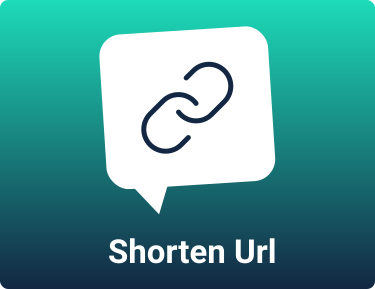

<h1 align="center">
    
</h1>

<p align="center">
  <a href="#technologies">Technologies</a>&nbsp;&nbsp;&nbsp;|&nbsp;&nbsp;&nbsp;
  <a href="#getting-started">Getting started</a>&nbsp;&nbsp;&nbsp;|&nbsp;&nbsp;&nbsp;
  <a href="#project">Project</a>&nbsp;&nbsp;&nbsp;|&nbsp;&nbsp;&nbsp;
  <a href="#application">Application</a>
</p>

<br>

<p align="center">
  
</p>

---

## Technologies

This project was developed using the following technologies:

- [React Native](https://reactnative.dev/)
- [Expo](https://expo.io/)
- [TypeScript](https://www.typescriptlang.org/)
- [API Bitly](https://dev.bitly.com/)

## Getting started

Clone the project and access the folder

```bash
$ git clone https://github.com/HelvioFilho/shorten-url.git && cd shorten-url
```

Follow the steps below
```bash
# Install the dependencies
$ yarn install

# Start the project
$ expo start
```

## Project

App developed to shorten url with the help of API Bitly.

## Application

Use the link below to try the app at the [expo](https://expo.io/)

[](https://expo.dev/@loihve/shortenUrl)